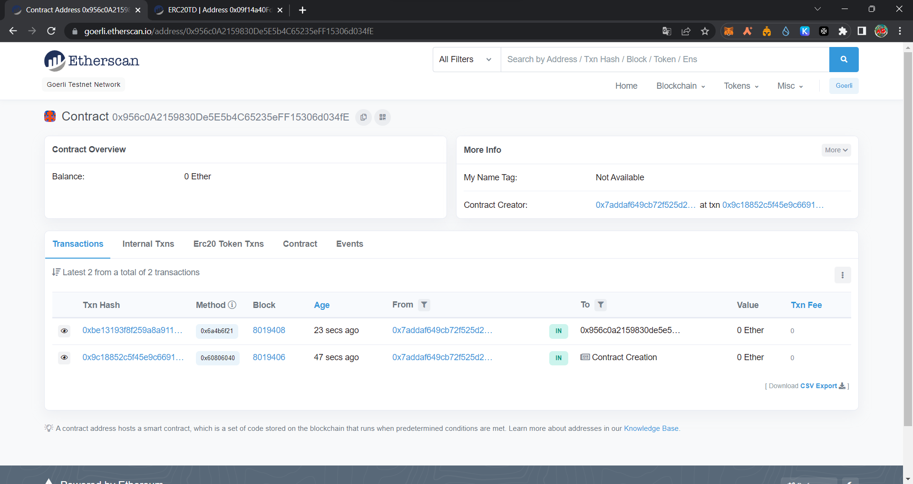
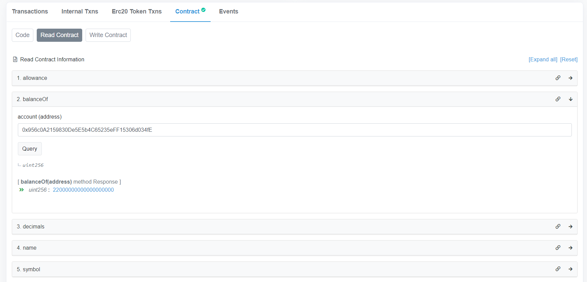

# ERC20 101  
## Introduction  
This project was created for a workshop at ESILV. The deposit and all information about it can be found here :  
https://github.com/l-henri/erc20-101  

I did not comment my code directly in contracts on purpose because you can find the breakdown of it below. 
I guarantee on my honor that this work is entirely personal.  


## Quick Summary
I managed to achieve all functions required, even the last "all in one" function, which finish all the workshop in a single transaction.  
The network used is goerli.  
Here is the address of the allInOneSolution contract :    
https://goerli.etherscan.io/address/0x956c0A2159830De5E5b4C65235eFF15306d034fE    

Here are some quick proofs :
  
  


## Code Breakdown 

**MyToken.sol**   
  
I created 3 variables to store the whitelist, tier1 and tier2 addresses :  
```
    address[] private whitelist;
    mapping(address => bool) tier1;
    mapping(address => bool) tier2;
```
The addWhitelist function can add an address to the array variable called whitelist.  
The removeWhitelist function can remove an address from the array variable called whitelist.
The isCustomerWhiteListed function returns if an address is whitelisted or not.

The updateTier function can modify the mappings tier1 and tier2 for an address. For example,  
```
updateTier(address(0x000), 1, true);
```
can add an address to the tier 1. On the other hand,
```
updateTier(address(0x000), 1, false);
```
can remove the address from the tier 1.  
The customerTierLevel function returns the tier for a specific address.

The getToken function permits to mint the ERC20 of this contract to the caller of the function.
I added some requirements, like being whitelisted, and you get more tokens if your address is in tier 2.

The buyToken function is almost the same but to be able to call it, you need to send some ETH as it is a payable function.  

**IEvaluator.sol**  
  
This is an interface which allows me to call the functions of the evaluator contract.


**AllInOneSolution.sol**  
    
I created 3 variables in the contract :  
```
    MyToken MyERC20;
    IExerciceSolution test;
    IEvaluator eval;
```
The first is an instance of my ERC20 token from the 'MyToken.sol' contract. 
The second is just to be able to call the submitExercice function of the evaluator contract.  
The third is an instance of an interface of the evaluator contract, to be able to call them in this contract.

The completeWorkshop function is the function called by the evaluator contract in the 10th exercise. It is here that I call all the previous functions of the evaluator, in one single transaction.
Firstly, I get the ticker and the supply number for my ERC20 token, then I instantiate the ERC20 and submit its address.
After that, I added the evaluator contract address in the whitelist and tier 1, to be able to perform the getToken and buyToken calls.
Then, I simply added/removed from whitelist/tiers this same address multiple times based on the exercises requirements (exo 5 to 9)

The triggerExo10 function is called at the contract deployment, just to call the exo10 function of the evaluator contract, which itself will call the above completeWorkshop function.